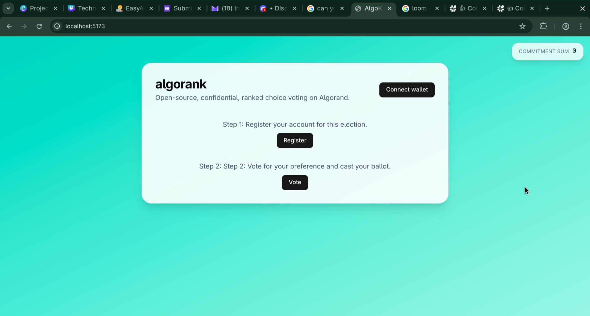
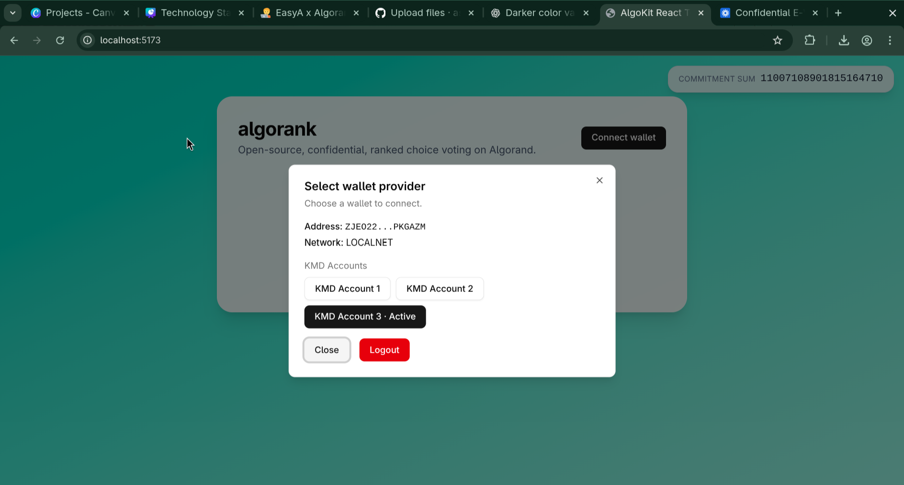
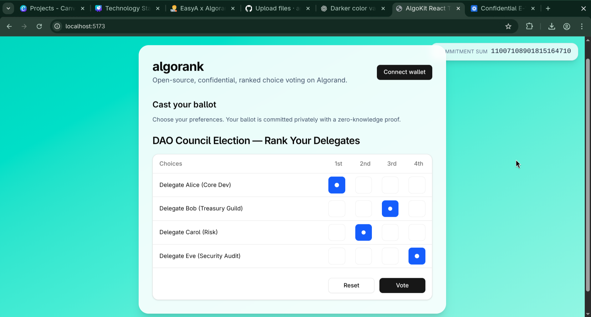

# algorank

## Demo video

[!(Demo video)[Confidential E-Voting System Demo with Algorand Applications 🔒.mp4]
](https://www.loom.com/share/e42c43c18f454e588efcc942c00a4820?sid=fde75898-96bb-4a81-a6e4-66b636cb7485)

## Screenshots

## How the smart contract works

### What the contract stores

#### Global state

- commitment_sum: UInt64 – running commitment (tally accumulator) that the verifier updates after each verified ballot.
- verifier_pk: Account – the only account allowed to verify ballots and update commitment_sum.
- verifier_set: UInt64 – flag (0/1) intended to “lock” the verifier once set.

#### Local state

- ballot_ipfs: Bytes – the IPFS CID the voter submitted for their ballot/proof.
- verified: UInt64 – 0 = cast but not verified; 1 = verified and included in the sum.

### Functions
#### 1) register (baremethod, OptIn)

Purpose: allow an account to opt in so it can hold local state.

Use: Voter calls ApplicationOptIn → local storage for that voter is created.

#### 2) cast_ballot(ipfs_hash: Bytes) -> String

If a verified value already exists for this account (i.e., they’ve cast before).
Otherwise, it writes:
ballot_ipfs[account] = ipfs_hash
verified[account] = 0

Purpose: Creates the voter’s local record and marks it “unverified.” A second call from the same account is blocked because verified now “exists”.

#### 3) set_verifier() -> String

Purpose: Whoever calls this last becomes the verifier.

#### 4) verify_ballot(for_account: Account, new_commitment_sum: UInt64) -> String

Purpose: Marks a ballot as verified and updates the global commitment accumulator to the value supplied by the verifier.
